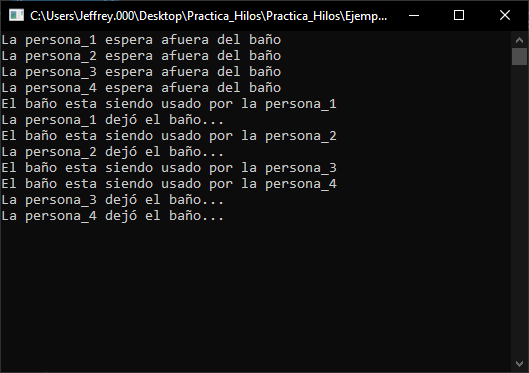

# Ejemplo de uso de lock con multiprocesamiento e hilos en C#

Este programa simula la fila de entrada a un baño público.

Se utilizan hilos para simular a las personas que esperan pro un espacio en el baño.

Una vez la persona entra en el baño se cancela la entrada de otras personas, quienes deben esperar hasta que la persona (hilo) termine de utilizar el baño.

